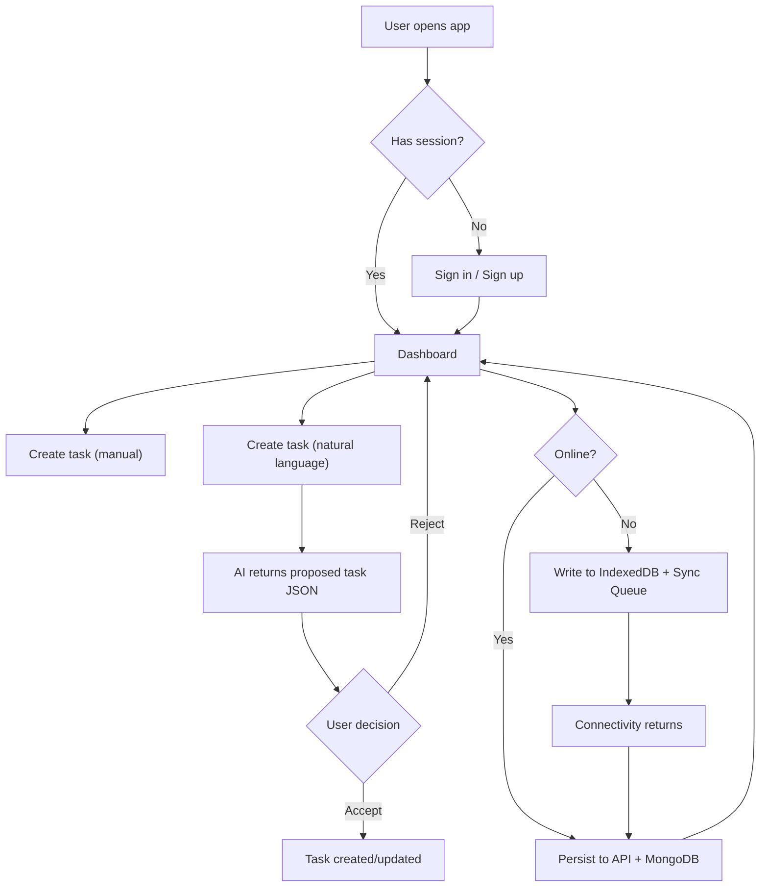

## 1. Product Overview
AURA (AI-Enhanced User Responsive Assistant) is a high-end, AI-assisted task manager that turns natural language into actionable tasks and supports sustainable productivity through “Agentic UX”.
- Target users: knowledge workers, students, founders, and teams who want calm structure, offline resilience, and assistive planning without losing control.

## 2. Core Features

### 2.1 User Roles
| Role | Registration Method | Core Permissions |
|------|---------------------|------------------|
| User | Email + password | Manage own profile, tasks, AI suggestions, offline actions, analytics |

### 2.2 Feature Module
1. **Auth**: register, login, refresh, logout, session persistence.
2. **Task Engine**: create/edit/delete tasks, kanban status flow, filters, search, quick add.
3. **AI Engine**: natural language parsing to task JSON, predictive daily itinerary suggestions.
4. **Offline & Sync**: offline-first UI, sync queue, conflict handling, background sync.
5. **Modes**: Deep Work, Planning, Review as state-driven layouts.
6. **Accessibility & Privacy**: WCAG AA, opt-in analytics, anonymization for AI-derived insights.

### 2.3 Page Details
| Page Name | Module Name | Feature description |
|-----------|-------------|---------------------|
| Auth | Sign in / Sign up | Email/password flow, inline validation, error recovery, token refresh |
| Dashboard | Command Bar | Quick add, natural language input, global search, keyboard-first UX |
| Dashboard | Kanban Board | Backlog → Todo → In-progress → Review → Done, drag/drop (optional), inline edits |
| Dashboard | Task Detail | Title/description/status/priority/category/duration, activity metadata |
| Dashboard | AI Panel | Parse input to proposed task, itinerary suggestions, Accept/Reject gating |
| Dashboard | Modes | Deep Work (focus list), Planning (calendar-like agenda), Review (analytics) |
| Settings | Account | Profile basics, password change, session control |
| Settings | Privacy | Toggle anonymized behavior metrics, data export/delete |
| Offline | Sync Center | Queue visualization, retry, merge resolution prompts, last sync status |

## 3. Core Process
Primary flows:
1. User registers/logs in and lands on Dashboard.
2. User creates tasks manually or via natural language; AI returns a proposed structured task.
3. User must explicitly Accept/Reject any AI suggestion before it is applied.
4. When offline, task actions are stored locally and queued; when online, changes sync to server automatically.
5. User switches between Deep Work / Planning / Review modes depending on context.

## 4. User Interface Design

### 4.1 Design Style
- Default theme: high-end Dark Mode with calm glassmorphism 2.0
- Palette:
  - Base: deep matte blacks (#000000 to #121212)
  - Accent: stylish gold (#D4AF37 / #C5A021) for primary actions and progress indicators
- Glass containers: semi-transparent dark surfaces, subtle blur, gold-tinted hairline borders
- Typography: luxury editorial pairing (distinct display font + refined body font), high contrast text
- Motion: restrained, purposeful micro-interactions (focus rings, card hover lift, mode transitions)
- Accessibility: keyboard-first navigation, visible focus states, high-contrast gold-on-black where needed

### 4.2 Page Design Overview
| Page Name | Module Name | UI Elements |
|-----------|-------------|-------------|
| Auth | Form Shell | Centered glass card, gold primary buttons, inline validation, strong focus rings |
| Dashboard | Shell | Sidebar + top command bar, glass panels, gold status indicators |
| Dashboard | Modes | Deep Work collapses sidebar; Planning expands agenda; Review emphasizes charts |
| Dashboard | Kanban | Column cards with subtle blur, draggable handles, status-colored gold accents |
| Dashboard | AI Panel | “Proposed changes” drawer with Accept/Reject CTA pair |
| Settings | Privacy | Toggles, explanatory text, clear data controls and export/delete actions |

### 4.3 Responsiveness
- Desktop-first with responsive breakpoints for tablets and mobile
- Mobile: bottom sheet for task details, collapsible panels, thumb-friendly controls
- Touch: large tap targets, persistent focus styling, reduced motion preference support

