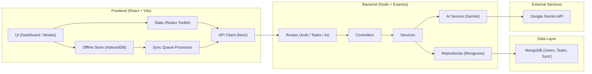
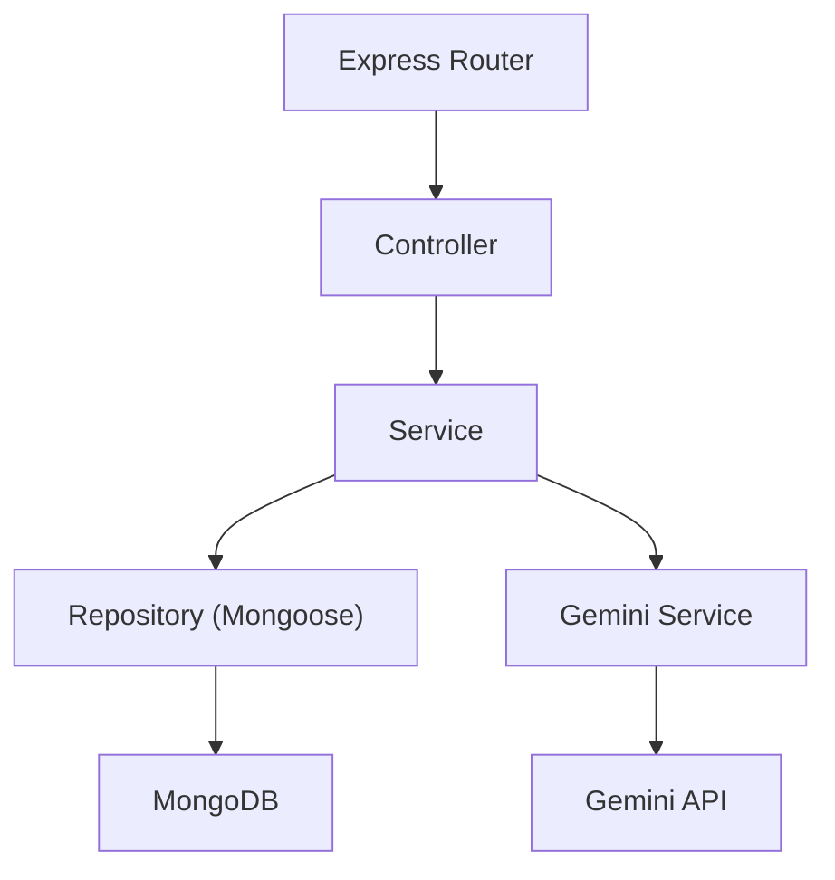
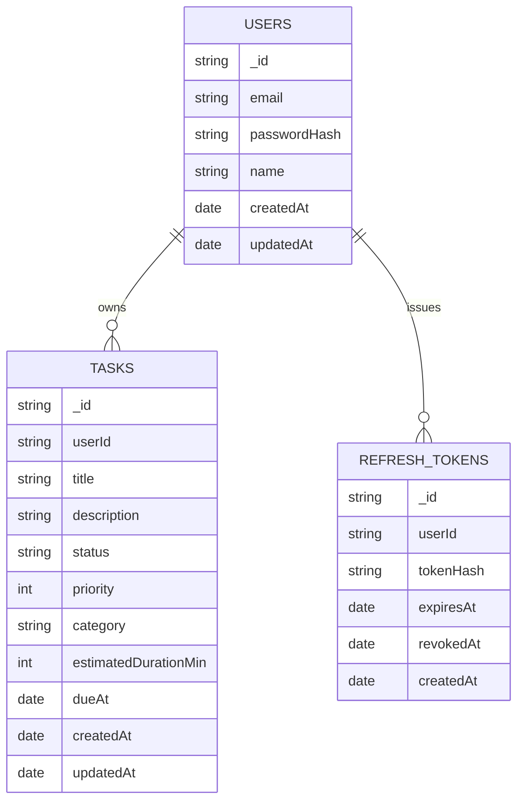

## 1. Architecture Design



## 2. Technology Description
- Frontend: React@18 + Vite + tailwindcss@3 + Redux Toolkit
- Offline: IndexedDB (via a small wrapper; avoid heavy dependencies unless needed)
- Backend: Node.js + Express@4
- Database: MongoDB + Mongoose ODM
- Auth: JWT access token + refresh token rotation; bcrypt password hashing
- AI: Gemini API for NLP parsing and itinerary suggestions

## 3. Route Definitions
| Route | Purpose |
|-------|---------|
| /auth | Login, register, refresh, logout |
| /app | Main dashboard with task system + modes |
| /settings | Account + privacy controls |

## 4. API Definitions

### 4.1 Auth
- POST /api/auth/register
  - Request: { email, password, name? }
  - Response: { user, tokens: { accessToken, refreshToken } }
- POST /api/auth/login
  - Request: { email, password }
  - Response: { user, tokens: { accessToken, refreshToken } }
- POST /api/auth/refresh
  - Request: { refreshToken }
  - Response: { tokens: { accessToken, refreshToken } }
- POST /api/auth/logout
  - Request: { refreshToken }
  - Response: { ok: true }

### 4.2 Tasks
- GET /api/tasks
  - Query: status?, priority?, category?, q?
  - Response: { tasks: Task[] }
- POST /api/tasks
  - Request: TaskCreate
  - Response: { task: Task }
- GET /api/tasks/:id
  - Response: { task: Task }
- PATCH /api/tasks/:id
  - Request: TaskUpdate
  - Response: { task: Task }
- DELETE /api/tasks/:id
  - Response: { ok: true }

### 4.3 AI
- POST /api/ai/parse
  - Request: { text: string, timezone?: string }
  - Response: { proposedTask: TaskCreate, confidence?: number, warnings?: string[] }
- POST /api/ai/itinerary
  - Request: { dateISO: string, timezone?: string }
  - Response: { suggestions: ItinerarySuggestion[], rationale?: string }

### 4.4 Offline Sync
- POST /api/sync/batch
  - Request: { actions: SyncAction[] }
  - Response: { results: SyncActionResult[], serverTime: string }

### 4.5 Type Shapes (canonical)
```ts
export type TaskStatus = "backlog" | "todo" | "in-progress" | "review" | "done"

export interface Task {
  _id: string
  userId: string
  title: string
  description?: string
  status: TaskStatus
  priority: 1 | 2 | 3 | 4 | 5
  category?: string
  estimatedDurationMin?: number
  dueAt?: string
  createdAt: string
  updatedAt: string
}

export interface TaskCreate {
  title: string
  description?: string
  status?: TaskStatus
  priority?: 1 | 2 | 3 | 4 | 5
  category?: string
  estimatedDurationMin?: number
  dueAt?: string
}

export interface TaskUpdate extends Partial<TaskCreate> {}

export type SyncActionType =
  | "TASK_CREATE"
  | "TASK_UPDATE"
  | "TASK_DELETE"

export interface SyncAction {
  id: string
  type: SyncActionType
  createdAt: string
  payload: unknown
}

export interface SyncActionResult {
  id: string
  ok: boolean
  error?: string
}
```

## 5. Server Architecture Diagram



## 6. Data Model

### 6.1 Data Model Definition


### 6.2 Indexing & Performance Notes
- Tasks: compound index { userId: 1, status: 1, updatedAt: -1 }
- Tasks search: text index on { title, description, category } (optional; consider language-specific tokenization)
- Refresh tokens: index { userId: 1, expiresAt: 1 } with TTL on expiresAt

